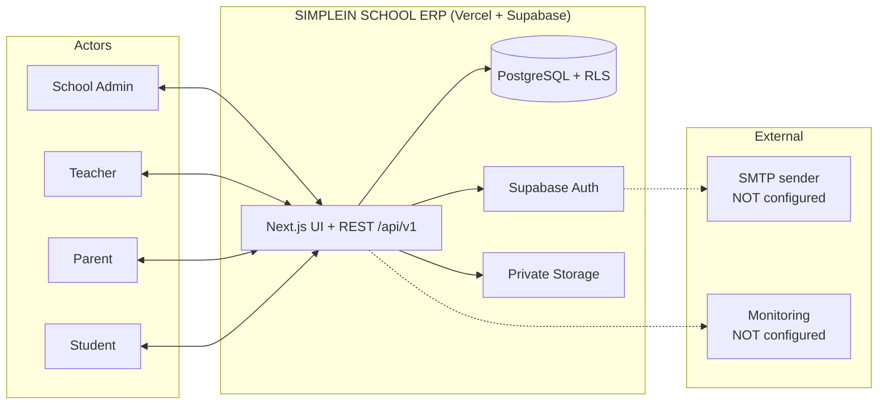
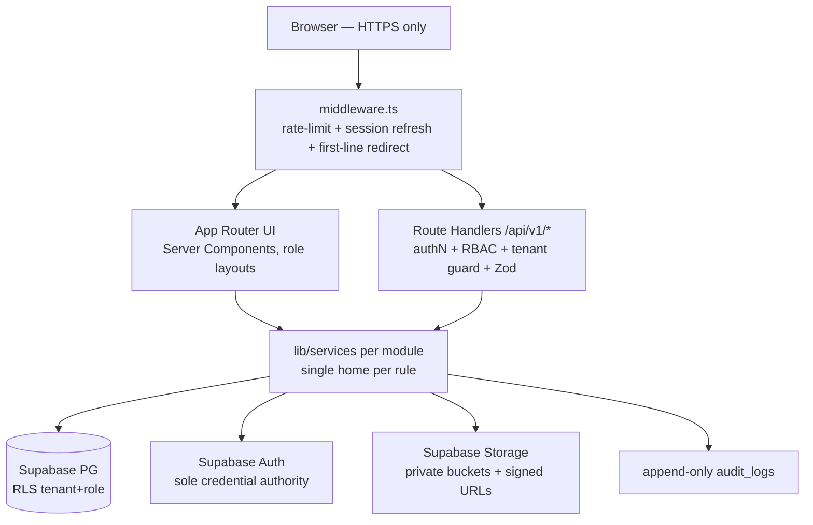
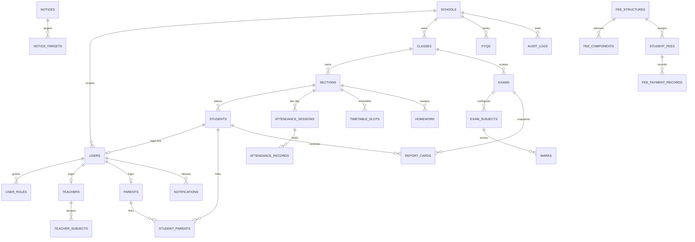
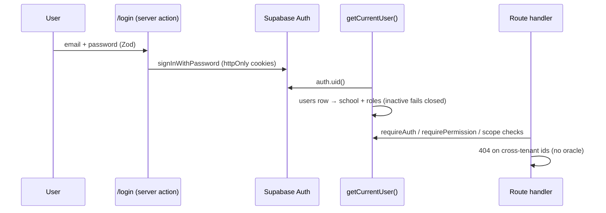
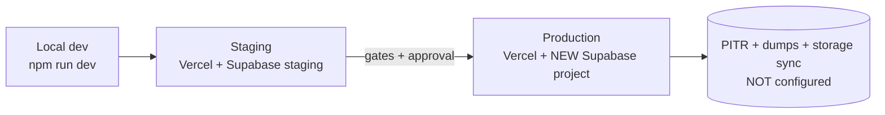

# SIMPLEIN SCHOOL ERP — System Architecture (V1, Phase 15)

Guide-structured technical record. Deep design lives in the linked docs;
this page is the map: context, structure, data, security, operations.
Notation: Mermaid (renders on GitHub). Truthfulness rule: only implemented
behavior is described; anything planned is marked as such.

> Note: no external `SIS-TECH-SEC-DATA-002` attachment was available in the
> working session, so this document follows the structure enumerated in the
> Phase 15 brief (§15) using standard architecture-description practice.

- Product/stack/roadmap: `docs/ARCHITECTURE.md`
- Entities/RLS: `docs/DATABASE.md` · REST: `docs/API.md` + `docs/openapi.yaml`
- Posture: `docs/SECURITY.md` · Readiness: `docs/PRODUCTION_READINESS.md`
- Operations: `docs/PRODUCTION_DEPLOYMENT.md`, `docs/BACKUP_AND_RECOVERY.md`,
  `docs/MONITORING.md`, `docs/CI_CD.md`, `docs/DATA_GOVERNANCE.md`
- Risks/decisions: `docs/RISK_REGISTER.md`

## 1. System context

Out of V1 scope (explicit): online payments, SMS/WhatsApp, native mobile,
platform super-admin, realtime fan-out (in-request chunked instead).

## 2. High-level architecture (modular monolith)

Request lifecycle (every authenticated request): refresh session →
`auth.uid() → public.users → { school, roles }` (never from client input) →
RBAC matrix check → Zod validation → `school_id`-scoped query (RLS
re-enforces) → audit row → standard envelope (`{ data }` / `{ error }`).

## 3. Component architecture

| Component | Location | Responsibility |
|-----------|----------|----------------|
| Dashboards | `app/(admin\|teacher\|parent\|student)/` | UX gating ONLY (layouts re-verify) |
| REST handlers | `app/api/v1/*` (129 ops) | auth + RBAC + tenant guard + validation |
| Session/RBAC | `lib/auth/session.ts`, `lib/auth/rbac.ts` | session resolution, permission matrix (single source) |
| Scopes | `lib/auth/scope.ts` | teacher/parent/student link resolution |
| Services | `lib/services/<module>/` | business rules, tenant injection, audit writes |
| Validation | `lib/validation/<module>.ts` (Zod) | shared UI + API schemas |
| Supabase clients | `lib/supabase/{client,server,admin}.ts` | user-context (RLS) vs isolated service-role |
| Rate limiting | `lib/security/rate-limit.ts` + `middleware.ts` | AUTH 10/10min, WRITE 120/min, READ 600/min per IP |

## 4. Technology stack

Next.js 15 (App Router) · React 19 · TypeScript strict · Tailwind v4 ·
Supabase (PG 17 + Auth + Storage) · Zod · pdf-lib (report PDFs) · xlsx
(import) · Vitest (289 tests) · Vercel (app). No Redis, no gateway SDKs,
no SMS vendors in V1 (verified: no such dependencies in `package.json`).

## 5. Data architecture (text ER; full reference: `docs/DATABASE.md`)

Tenancy: shared schema, `school_id` on every tenant row, RLS + immutable
`school_id` + tenant-consistency triggers. Money `NUMERIC(12,2)`; no
`transactions` vocabulary (records-only fees).

## 6. API architecture

Base `/api/v1`, REST + JSON, version-prefixed. Envelope: `{ data }` /
`{ meta }` for lists; errors `{ error: { code, message } }` with stable
codes; validation → 422; cross-tenant → 404 (never existence-revealing
403). Pagination `?page&limit` (cap 100). Generated contract:
`docs/openapi.yaml` (129 ops, regenerated via
`scripts/generate-openapi.mjs`).

## 7. Authentication / RBAC data-flow

Roles: `SCHOOL_ADMIN` (own school, full CRUD) · `TEACHER` (link-scoped
reads + assigned writes) · `PARENT` (linked-children reads) · `STUDENT`
(self-only reads; published results/cards only). Deny-by-default; unknown
→ deny. STUDENT activated Phase 12; dormant nowhere else.

## 8. Security controls (threat → location → verification → owner)

| # | Threat | Control (location) | Verified by | Owner |
|---|--------|-------------------|-------------|-------|
| C1 | Cross-tenant read/write | RLS `school_id` policies + service guards → 404 (`supabase/migrations`, `lib/services`) | 282+ live pgTAP assertions; cross-school suites per module | TBD backend owner |
| C2 | Privilege escalation | Static RBAC matrix (`lib/auth/rbac.ts`); no role strings elsewhere; admin cannot grant SCHOOL_ADMIN/self-disable | `lib/auth/rbac.test.ts`; E2E role tests | TBD |
| C3 | Credential theft/reuse | Supabase Auth sole authority; httpOnly SameSite cookies; no tokens in storage; no password columns | E2E login/logout/inactive tests | TBD |
| C4 | Identity/tenant hopping | `prevent_identity_change()` trigger; service-role boundary (`lib/supabase/admin.ts` imported only by onboarding/users) | Migration 0002; grep audit; pgTAP trigger tests | TBD |
| C5 | Silent grade/fee tampering | Lock/publish states; maker≠checker verify/void; frozen structures; append-only audit with before/after | Unit (grading/fee math) + pgTAP + E2E | TBD |
| C6 | Malicious uploads | Allowlist + 10 MB/2 MB caps + macro/executable block (`lib/services/storage.ts`); private buckets; 600 s signed URLs after record authz | E2E signed downloads; allowlist unit tests | TBD |
| C7 | CSRF | SameSite=Lax cookies; same-origin JSON mutations | Header + cookie audit | TBD |
| C8 | Clickjacking/MIME sniffing | `X-Frame-Options: DENY`, `nosniff`, HSTS, referrer/permissions policies (`next.config.mjs`) | E2E header checks | TBD |
| C9 | Brute force / scraping | Tiered rate limits + `Retry-After` (`middleware.ts`) | `rate-limit.test.ts`; E2E 429s observed | TBD |
| C10 | Error/SQL leakage | Standard envelope, generic `INTERNAL`, server-only logs | E2E (no internals in responses) | TBD |
| C11 | Secret leakage | `.env.example` names-only; `.gitignore` excludes env/credential files; repo secret scan clean | §19 verification | TBD |
| C12 | Missing CSP | **Deliberately deferred** (Next hydration needs nonce setup or weak `unsafe-inline`) — documented decision, revisit pre-launch | `docs/SECURITY.md` §14 | TBD |

Owner column is TBD throughout (requires staffing approval) — do not treat
"verified by" automation as a substitute for an accountable owner.

## 9. Audit logging

Append-only `audit_logs(school_id, actor, action, entity, entity_id,
metadata)`; coverage: users/students/teachers/parents/classes/subjects/
years/imports/enrollments/attendance/exams/marks/lock/publish/report-cards/
timetable/homework/notices/notifications-fanout/fees/promotions/PYQs/school
creation. No UPDATE/DELETE grants. Retention TBD (see
`docs/DATA_GOVERNANCE.md`).

## 10. Integration boundaries

- Inbound: browsers only (same-origin UI + API). No public API consumers,
  no webhooks, no third-party callbacks in V1.
- Outbound: Supabase cloud (PG/Auth/Storage) + future SMTP (unconfigured) +
  future error-tracker/uptime endpoints (unconfigured). No payment, SMS, or
  email providers wired in code.

## 11. Deployment architecture

One codebase, per-environment env values, forward-only migrations, Vercel
preview + staging + production promotion (see `docs/PRODUCTION_DEPLOYMENT.md`,
`docs/CI_CD.md`).

## 12. CI/CD, performance, backup/recovery, monitoring

Per docs: `docs/CI_CD.md` (no pipeline yet — required), §14 posture
(paginated lists, capped imports, chunked fan-out, tenant-leading indexes;
no premature optimization), `docs/BACKUP_AND_RECOVERY.md` (not configured),
`docs/MONITORING.md` (not configured).

## 13. Risks & ADRs

`docs/RISK_REGISTER.md` (risk IDs, impact/likelihood/mitigation/owner/
status) + architecture decisions (AD-1… in `docs/ARCHITECTURE.md` §28 and
post-baseline ADRs in the register).

## 14. Traceability (requirement → implementation → proof)

| Requirement | Implementation | Proof |
|-------------|----------------|-------|
| Tenant isolation | `school_id` + RLS + triggers | pgTAP cross-school suites (all modules) |
| Role scoping | matrix + link helpers + service 404s | `rbac.test.ts`, `scope.test.ts`, E2E role tests |
| Publish gating | lock/publish flags + RLS + service | marks/report pgTAP + E2E |
| Fee integrity | records-only + maker-checker + frozen structures | `fees.test.ts`, pgTAP, E2E |
| Private files | buckets + allowlist + signed URLs | `storage.test.ts`, E2E downloads |
| Auditability | append-only logs + before/after diffs | service audit tests |
| Student self-scope | `students.user_id` + published-only branches | `student-portal.test.ts`, phase12 pgTAP (41) |
